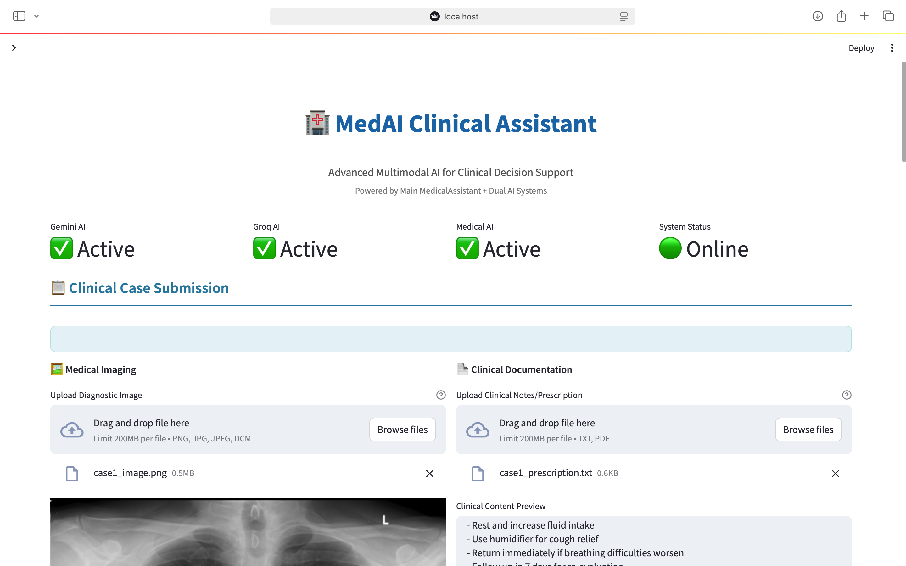
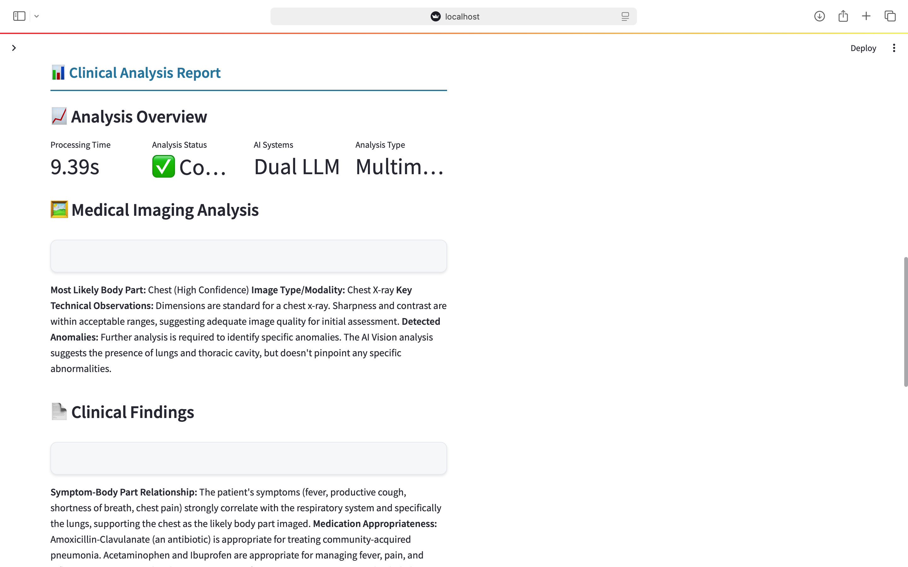
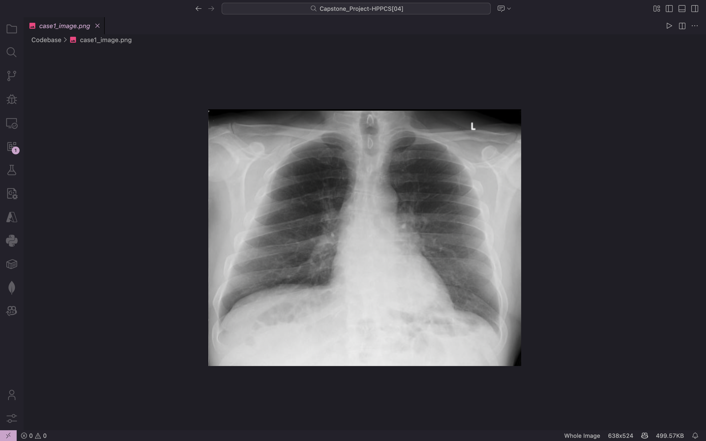
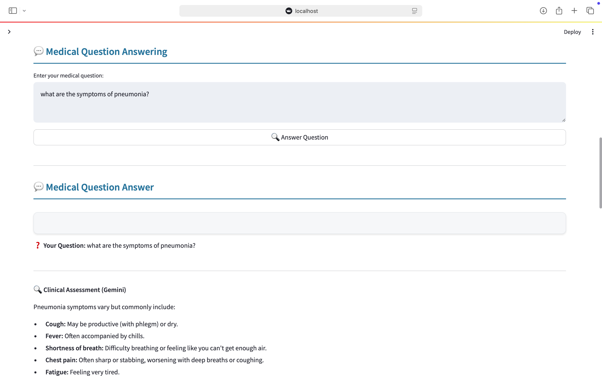
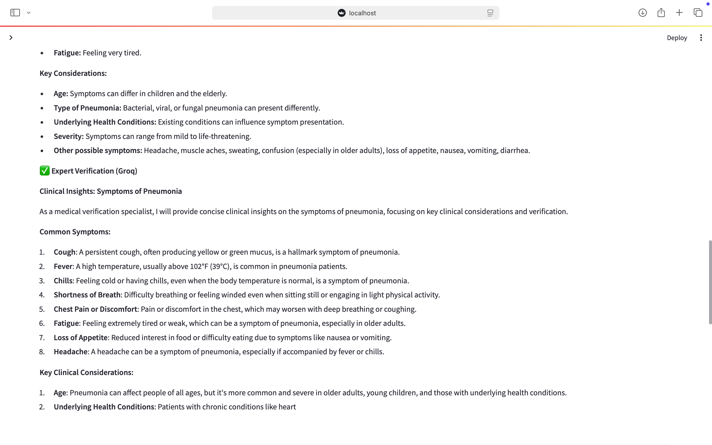

# MedAI: Multimodal Clinical Decision Support System


## Overview

**MedAI** is a multimodal clinical decision support system that combines **medical imaging analysis** and **clinical text interpretation** using dual large language models — **Google Gemini 2.0 Flash** and **Llama 3.1 via Groq API**.
It provides integrated clinical assessments, anomaly detection, and treatment recommendations through structured JSON outputs.

## Key Features

* Multimodal integration (image + text)
* Dual-LLM verification (Gemini + Llama 3.1)
* Real-time and batch inference modes
* Automatic entity extraction and diagnosis correlation
* Streamlit-based visualization interface
* Structured JSON report generation
  
## Execution steps

```bash
1. Install dependencies:
   pip install -r requirements.txt

2. Run in CLI mode (process all 5 cases):
   python main.py YOUR_GROQ_API_KEY YOUR_GEMINI_API_KEY

3. Run in UI mode (web dashboard):
      python main.py
      Then enter API keys in terminal when asked

API KEYS REQUIRED:
------------------
- Groq API Key (for Llama 3.1 via Groq)
- Gemini API Key (for Google Gemini)

USAGE EXAMPLES:
---------------
# Process all 5 cases automatically:
python main.py gsk_abc123... AIzaSyxyz456...

# Enter keys manually and launch UI:
python main.py
```
## Results Summary

| Case | Condition          | Image Type      | Clinical Correlation | Processing Time |
| ---- | ------------------ | --------------- | -------------------- | --------------- |
| 1    | Pneumonia          | Chest X-ray     | ✅ Excellent          | 10.38s          |
| 2    | Chronic Migraine   | Brain MRI       | ✅ Strong             | 10.33s          |
| 3    | Osteoarthritis     | Knee X-ray      | ✅ High Confidence    | 9.63s           |
| 4    | Post-appendectomy  | Abdominal X-ray | ✅ Consistent         | 8.87s           |
| 5    | COVID-19 Pneumonia | Chest X-ray     | ✅ Strong             | 11.29s          |

**Success Rate:** 100% (5/5)
**Average Processing Time:** 10.1s
**API Reliability:** 100% uptime

## Output

### Streamlit Dashboard





### Example Case: Chest X-Ray – Pneumonia



### Chatbot





## Troubleshooting

* Ensure valid API keys are provided before running.
* Requires an active internet connection for Groq and Gemini APIs.
* If Streamlit fails to load, check for port conflicts or reinstall dependencies:

  ```bash
  pip install --upgrade streamlit
  pip install --upgrade pip
  ```

## Credits & Acknowledgement

Developed by **Geshna Balaji** under the **HAAI++ Capstone Program**.
Special thanks to the open-source AI community and platforms like **Google Gemini**, **Groq**, and **LangChain** for enabling this research and development.

## License

This project is released under the **MIT License** – free to use, modify, and distribute with attribution.

